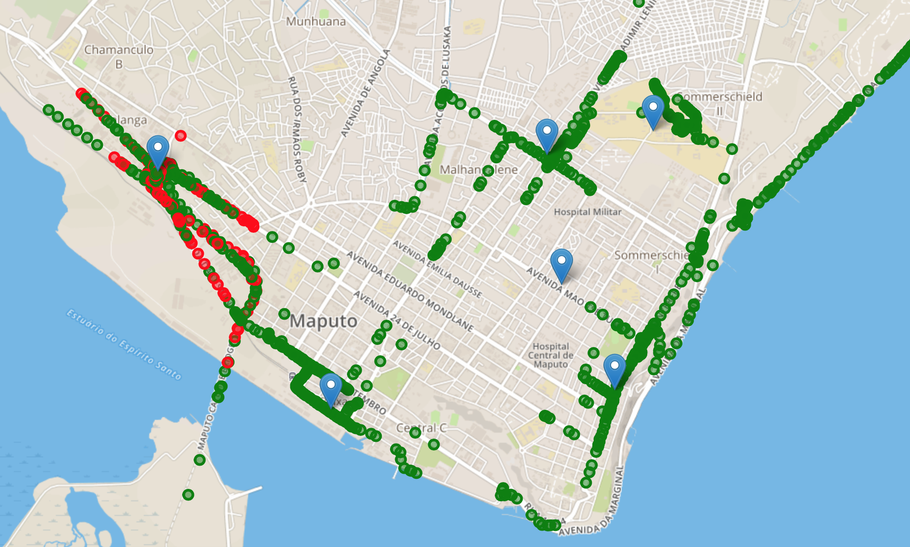

LocalTTNMapper
===
_This version is made to work with payload format of the [Adafruit Feather M0](https://github.com/NielsOerbaek/FeatherTTNMapper)_

#### Changes:
A few bugs have been fixed, and a markerCluster library is imported, but not used yet.

===
> Disclaimer: this system is not a substitute of TTNMapper! I suggest using it in addition to TTNMapper if you want to quickly produce a coverage map for a workshop/test/experiment.
> Your TTN application should receive data from a GPS-enabled node in such a way that TTNMapper can map the data. 

Start with a fresh Rasbian installation. I used version 4.14.79. Connect to the Internet and download the latest updates.

**Install Apache**

Install the apache2 package with this command:

`sudo apt-get install apache2 -y`

This default web page is served when you browse to http://localhost/ on the Pi itself, or http://192.168.1.10 (whatever the Pi's IP address is) from another computer on the network. To find the Pi's IP address, type `hostname -I` at the command line

Browse to the default web page either on the Pi or from another computer on the network and you should see the Apache 2 Debian Default Page. This means you have Apache working!

You can now make yourself the owner of that directory

`sudo chown pi /var/www/html`

But you definitely want to set the permissions

`sudo chmod 777 -R /var/www/html`

**Install python**

To install Python 2.7  open up terminal and enter:

`sudo apt install python-minimal`

**Install MQTT paho**

You can Install the MQTT client using PIP with the command:

`pip install paho-mqtt`

**Install the files**

Go to your home directory if you are not there already:

`cd ~`

Clone the github repository:

`git clone https://github.com/marcozennaro/LocalTTNMapper.git` 

You will have two directories, one called home and one called html. Home contains the python files that are to be executed in the home directory, you can thererfore copy the python files to the home directory. The html folder contains files that have to be copies to the folder that is executed by apache2. First create a specific directory called coverage for the files:

`sudo mkdir /var/www/html/coverage`

then copy all the files from html to this new directory with:

`sudo cp -R * /var/www/html/coverage/`

**Setting up the map**

You need to center the map first. Move to the map directory with:

`cd /var/www/html/coverage/js`

and edit the file called main.js. Change the values of 'center' to reflect the center of your map:

    center: [-25.9624874,32.5764987],

will show a map centered around a latitude of -25.9624874 and a longitude of 32.5764987.

You can visit latlong.net to find the latitude and longitude from a map.

The 'zoom' value determines how much the map is zoomed around the center point.

**Setting up the scripts**

***Adding the gateways to the map***

To add the gateways to the map you first need to add the center map location to the add_gateways.py file. Move to your home directory with `cd ~` and edit the add_gateways.py file. Edit this line:

`url = "https://www.thethingsnetwork.org/gateway-data/location?latitude=-25.956902262&longitude=32.6067479&distance=20000"`

to match with the center of the map. Change the distance to the range you want to include for the gateways in your map. distance=20000 will show all the gateways in a range of 20km from the center of the map.

Check if the script is working with:

`sudo ./add_gateways.py`

You should get a list of gateways.

***Adding the nodes to the map***

To add the nodes to the map you need to add the TTN application information to the coverage.py file. Edit this line:

`client.username_pw_set("tracker-XXXXX", password="ttn-account-v2.CNIig8dr0XXXXXXXwkM9d7IJytEQMuygz_-8")`

and add your TTN application's ID and the TTN application's Access Key.

Check if the script is working with:

`./coverage.py`

***Adding the script to cron***

If you want the script to be added to cron so that it is executed automatically, you have to edit the crontab with:

`crontab -e`

and add at the end of the file the following line:

`@reboot sleep 30 && /home/pi/coverage.py & > /home/pi/log.txt 2>&1`

Reboot your computer with `sudo reboot` and check if the script is working with `pgrep coverage.py`. If you get a number then the script is running in the background. 

You are set to map the coverage of your TTN network! If you click on the blu icon it will show the name of the Gateway, the description and the antenna height. If you click on any colored dot, a pop-up will appear with the name of the node, the frequency, the data rate and the list of gateways that have received the signal with RSSI and SNR values.

